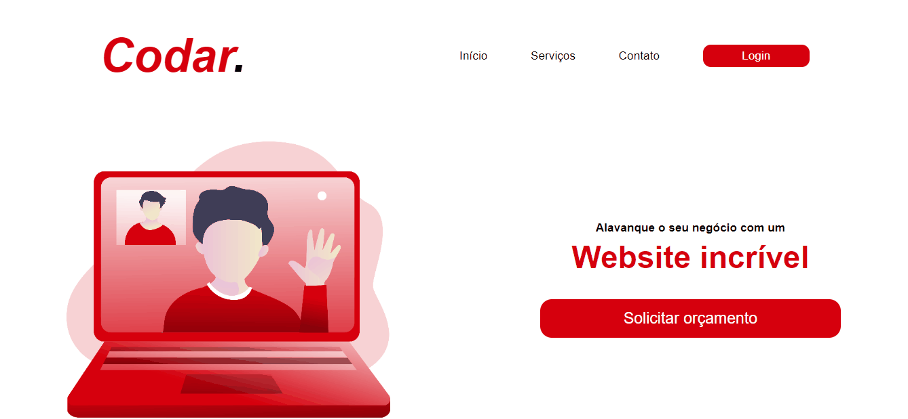

<h1 style='font-size: 40px'>Music Library</h1>

The codar project is a challenge from the DevChallenge website, aiming to create a fictitious website with a layout adaptable to different screens

The project has two versions, a mobile version and a desktop version.

    
    
<h2 style='font-size: 25px'>the following technologies were used for the development of the application:</h2>

- HTML5

- CSS3

- Javascript
